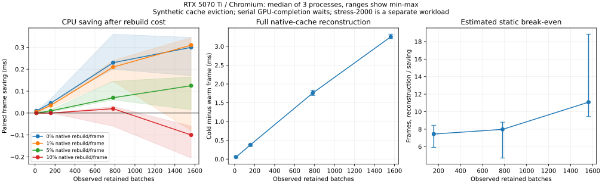

# Phase 2: scale, rebuild cost and churn

Decision: production candidate accepted for adaptive promotion of stable retained content. These measurements justify implementation work, not unconditional native replay or a universal profitability threshold. Lifecycle safety, promotion behavior and integrated overhead remain implementation gates. The proposed production path uses normal replay while observing stability, limited native construction after promotion, and immediate fallback after invalidation.

Source commit: `07d5ea5496381a24b82d491edf763578448574c5`, tree `c57d4ada609cb74bf0a227ecd4e2b72cb6b9e94f`. Windows, RTX 5070 Ti (OS adapter query), Chromium 153.0.8010.12; WebGPU identifies NVIDIA / Blackwell. No second physical GPU or iGPU is available on this machine. This is local diagnostic evidence, not a controlled cross-library reference profile.

The curves show medians of three independent process results, with min-max ranges rather than confidence intervals. The 13-batch break-even point is omitted because one process has no positive static saving. The forced 2,000-batch workload is intentionally separate from the ordinary scale curve.

## Scale and construction

Each cell uses a fresh browser process; three processes per cell. Sprites are 8x8. The ordinary scene retains the existing optimizer and cycles four blend modes in 64-sprite plateaus. The stress scene alternates Normal/Multiply and sets preserveDrawOrder to force exactly 2,000 batches. Its first attempted unordered construction collapsed to two batches, correctly failing the batch-count assertion; those failed attempts are excluded.

Times below are milliseconds. Savings are within-block differences of frame medians; ranges span the three process-level medians. Construction is the median paired cold-native minus warm-native frame time, with all group data already retained. Break-even is that incremental native reconstruction cost divided by static replay saving, calculated separately for each process. It is an estimate of needed reuse AFTER construction; waiting 30 frames before constructing a bundle does not pay for its future construction.

| Scene       | Observed batches |   Static saving | Full native reconstruction | Estimated static break-even |
| ----------- | ---------------: | --------------: | -------------------------: | --------------------------: |
| 1k          |               13 | -0.010 to 0.010 |             0.030 to 0.085 |   No stable positive result |
| 10k         |              157 |  0.045 to 0.065 |             0.335 to 0.385 |       5.923 to 8.444 frames |
| 50k         |              782 |  0.200 to 0.360 |             1.695 to 1.835 |       4.708 to 8.800 frames |
| 100k        |             1563 |  0.170 to 0.345 |             3.205 to 3.325 |      9.435 to 18.853 frames |
| stress-2000 |             2000 |  0.285 to 0.340 |             4.055 to 5.630 |     12.618 to 19.754 frames |

## Synthetic native-cache rebuilds

The rotating eviction schedule removes 0%, 1%, 5% or 10% of native payload cache entries per frame, accumulating fractional entries rather than rounding every frame upward. This retains all engine recording data and isolates native reconstruction. Both arms run the same eviction bookkeeping; it is not a measurement of real engine resource invalidation. Lifetime in this deterministic schedule is approximately 1/rate, not an observed lifetime distribution of real content.

| Scene       |       0% saving |       1% saving |      5% saving |       10% saving |
| ----------- | --------------: | --------------: | -------------: | ---------------: |
| 1k          | -0.010 to 0.010 |  0.000 to 0.010 | 0.000 to 0.005 |  -0.005 to 0.000 |
| 10k         |  0.045 to 0.065 |  0.025 to 0.040 | 0.005 to 0.015 |   0.000 to 0.000 |
| 50k         |  0.200 to 0.360 |  0.145 to 0.240 | 0.060 to 0.145 |  -0.060 to 0.030 |
| 100k        |  0.170 to 0.345 | -0.080 to 0.345 | 0.015 to 0.165 | -0.205 to -0.060 |
| stress-2000 |  0.285 to 0.340 |  0.295 to 0.335 | 0.075 to 0.405 | -0.100 to -0.070 |

The 100k scene loses at 10% eviction in all three processes. The 1% 100k range includes a negative run, and increasing from 50k to 100k does not double the benefit. These observations do not identify the cause of nonlinearity; browser/driver behavior, scheduling, garbage collection and other effects have not been separated. No fixed batch threshold or age guarantees profit.

## Dynamic and mixed cases

Camera moves the view by one pixel on alternating frames. Texture redraws the same canvas and calls updateSource each frame, preserving texture identity. Groups uses 100 actual RetainedContainers of 100 sprites each and calls invalidateContent on rotating 0/1/5/10% subsets every frame; unlike cache eviction, this exercises real recording replacement. Mixed has 40 ordered retained groups, each Sprite, Text, Tilemap, NineSlice geometry, Sprite: 200 retained batches from four renderer classes. All tested native renderers use the same final-encoding substitution and keep their existing resource/UBO upkeep live.

| Case    | Batches | Static / 0% saving |       10% saving |
| ------- | ------: | -----------------: | ---------------: |
| camera  |     157 |     0.040 to 0.055 |  -0.035 to 0.005 |
| texture |     157 |    -0.005 to 0.045 | -0.025 to -0.020 |
| groups  |     100 |     0.030 to 0.035 |   0.025 to 0.165 |
| mixed   |     200 |     0.370 to 0.465 |   0.250 to 0.320 |

Actual group invalidation drives the whole CPU frame into roughly 5-9 ms in this fixture; the small paired native differences are not evidence that native bundles solve the engine recording cost. The complete baseline/candidate timings and actual native build/group invalidation counts remain in the raw records. Those numbers must not be substituted for the synthetic-cache-only curve.

All 27 process/cell acquisitions completed without WebGPU validation errors. All final baseline/native/repeated-native RenderTexture readbacks match byte-for-byte; clear-only negative controls differ. Dynamic cases additionally compare baseline/native pixels at each churn rate. Mixed renderer counts verify that Sprite, Text, TileChunk and ScalableSprite all participated. These are bounded fixture checks, not general lifecycle coverage.

## Acquisition and remaining gates

120 warmup frames, one structural replay probe, 30 native warmup frames, 12 alternating cold/warm construction pairs, then six AB/BA blocks per eviction rate. Each arm gets 20 settling frames and 60 timed frames. Timed work includes scene updates, eviction or actual group invalidation, stats reset, clear, rendering and flush. GPU completion is awaited outside each timed region. Acquisition is serial, not a saturated pipelined game loop. Direct per-encoder build timers run in a separate diagnostic frame and are not used for break-even estimates. Summaries use upper-middle medians for even sample counts; sub-nanosecond floating-point residues in paired differences are normalized to zero.

No second hardware class, texture/view recreation, custom material uniforms, stencil/mask transitions, format-changing targets or device-generation changes are covered by this matrix. The stable offscreen target is not proof of target invalidation. Those remain correctness gates for production. Promotion age, workload floor, build-budget behavior and burst invalidation have not been measured by this eager per-batch prototype. No automatic eligibility policy is shipped here.

Use [reproduce.md](reproduce.md) for the complete disposable source snapshots. Raw files are `*-results.json`; derived process summaries are `*-summary.json`. The phase-1 timing acquisition remains unchanged. These new results refine the decision to pursue conditional integration while preserving normal retained replay as the correctness fallback.
